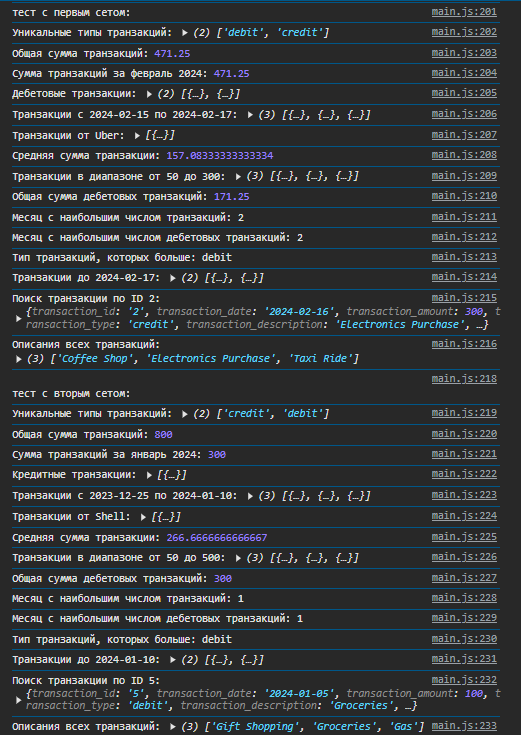

# Лабораторная №2 
## Запуск проекта
- Открытие файла `index.html`


## Цель лабораторной работы
Изучить основы работы с массивами и функциями в JavaScript, применяя их для обработки и анализа транзакций.


## Шаг 1. Создание массива транзакций

  - Создаем файл main.js для размещения вашего кода.
  - Берем массив объектов с транзакциями. Каждая транзакция содержит следующие свойства:

    - transaction_id - уникальный идентификатор транзакции.
    - transaction_date - дата транзакции.
    - transaction_amount - сумма транзакции.
    - transaction_type - тип транзакции (приход или расход).
    - transaction_description - описание транзакции.
    - merchant_name - название магазина или сервиса.
    - card_type - тип карты (кредитная или дебетовая).

## Шаг 2. Реализация функций для анализа транзакций


### 1. `getUniqueTransactionTypes(transactions)`

  - Возвращает массив уникальных типов транзакций.
  - Используйте Set() для выполнения задания.

  ```javascript
    const getUniqueTransactionTypes = (transactions) => [...new Set(transactions.map(t => t.transaction_type))];
  ```

### 2. `calculateTotalAmount(transactions)`  – Вычисляет сумму всех транзакций.

```JS
  const calculateTotalAmount = (transactions) => transactions.reduce((sum, t) => sum + t.transaction_amount, 0);
```

### 3. calculateTotalAmountByDate(transactions, year, month, day) [extra]

- Вычисляет общую сумму транзакций за указанный год, месяц и день.
- Параметры year, month и day являются необязательными.
- В случае отсутствия одного из параметров, метод производит расчет по остальным.

```JS
const calculateTotalAmountByDate = (transactions, year, month, day) => {
    return transactions
        .filter(t => {
            const date = new Date(t.transaction_date);
            return (!year || date.getFullYear() === year) &&
                   (!month || date.getMonth() + 1 === month) &&
                   (!day || date.getDate() === day);
        })
        .reduce((sum, t) => sum + t.transaction_amount, 0);
};
```

### 4. `getTransactionByType(transactions, type)` - Возвращает транзакции указанного типа (debit или credit)

```JS
const getTransactionByType = (transactions, type) => transactions.filter(t => t.transaction_type === type);
```

### 5. `getTransactionsInDateRange(transactions, startDate, endDate)` – Возвращает массив транзакций, проведенных в указанном диапазоне дат от startDate до endDate.

```JS
const getTransactionsInDateRange = (transactions, startDate, endDate) => {
    return transactions.filter(t => {
        const date = new Date(t.transaction_date);
        return date >= new Date(startDate) && date <= new Date(endDate);
    });
};
```

### 6. `getTransactionsByMerchant(transactions, merchantName)` – Возвращает массив транзакций, совершенных с указанным merchantName.

```js
const getTransactionsByMerchant = (transactions, merchantName) => transactions.filter(t => t.merchant_name === merchantName);
```

### 7. `calculateAverageTransactionAmount(transactions)` – Возвращает среднее значение транзакций.

```js
/**
 * Высчитывает среднее значение транзакции между всеми транзакциями
 * @param {Array} transactions Массив транзакций
 * @returns {Array} среднее арифметическое поля transaction_amount
 */
export function calculateAverageTransactionAmount(transactions)
{
    let sumAmount = calculateTotalAmount(transactions);
    return sumAmount / transactions.length;
}
```

### 8. `getTransactionsByAmountRange(transactions, minAmount, maxAmount)` – Возвращает массив транзакций с суммой в заданном диапазоне от minAmount до maxAmount.

```js
const calculateAverageTransactionAmount = (transactions) => transactions.length === 0 ? 0 : calculateTotalAmount(transactions) / transactions.length;
```

### 9. `calculateTotalDebitAmount(transactions)` – Вычисляет общую сумму дебетовых транзакций.

```js
const calculateTotalDebitAmount = (transactions) => calculateTotalAmount(getTransactionByType(transactions, "debit"));
```

### 10. `findMostTransactionsMonth(transactions)` – Возвращает месяц, в котором было больше всего транзакций.

```js
const findMostTransactionsMonth = (transactions) => {
    const counts = transactions.reduce((acc, t) => {
        const month = new Date(t.transaction_date).getMonth() + 1;
        acc[month] = (acc[month] || 0) + 1;
        return acc;
    }, {});
    return Object.keys(counts).reduce((a, b) => counts[a] > counts[b] ? a : b);
};
```

### 11. `findMostDebitTransactionMonth(transactions)` – Возвращает месяц, в котором было больше дебетовых транзакций.

```js
const findMostDebitTransactionMonth = (transactions) => findMostTransactionsMonth(getTransactionByType(transactions, "debit"));
```

### 12. `mostTransactionTypes(transactions)` -
- Возвращает каких транзакций больше всего.
- Возвращает debit, если дебетовых.
- Возвращает credit, если кредитовых.
- Возвращает equal, если количество равно.

```js
const mostTransactionTypes = (transactions) => {
    const debitCount = getTransactionByType(transactions, "debit").length;
    const creditCount = getTransactionByType(transactions, "credit").length;
    return debitCount > creditCount ? "debit" : creditCount > debitCount ? "credit" : "equal";
};
```

### 13. `getTransactionsBeforeDate(transactions, date)` – Возвращает массив транзакций, совершенных до указанной даты.

```js
const getTransactionsBeforeDate = (transactions, date) => transactions.filter(t => new Date(t.transaction_date) < new Date(date));
```

### 14. `findTransactionById(transactions, id)` – Возвращает транзакцию по ее уникальному идентификатору (id).

```js
const findTransactionById = (transactions, id) => transactions.find(t => t.transaction_id === id);
```

### 15. `mapTransactionDescriptions(transactions)` – Возвращает новый массив, содержащий только описания транзакций.

```js
const mapTransactionDescriptions = (transactions) => transactions.map(t => t.transaction_description);
```


## Шаг 3. Тестирование функций

1. Создайте массив транзакций и протестируйте все функции.
2. Выведите результаты в консоль.
    

3. Проверьте работу функций на различных наборах данных.
    


  ```js
  #main.js
  
  const transactions = [
    {
        transaction_id: "1",
        transaction_date: "2024-03-01",
        transaction_amount: 150.75,
        transaction_type: "debit",
        transaction_description: "Grocery shopping",
        merchant_name: "SuperMart",
        card_type: "debit"
    },
    {
        transaction_id: "2",
        transaction_date: "2024-03-02",
        transaction_amount: 200.00,
        transaction_type: "credit",
        transaction_description: "Online purchase",
        merchant_name: "Amazon",
        card_type: "credit"
    },
    {
        transaction_id: "3",
        transaction_date: "2024-03-03",
        transaction_amount: 75.50,
        transaction_type: "debit",
        transaction_description: "Restaurant bill",
        merchant_name: "Foodie Place",
        card_type: "debit"
    }
];
  
console.log(getUniqueTransactionTypes(transactions));
console.log(calculateTotalAmount(transactions));
console.log(calculateTotalAmountByDate(transactions, 2024, 3));
console.log(getTransactionByType(transactions, "debit"));
console.log(getTransactionsInDateRange(transactions, "2024-03-01", "2024-03-03"));
console.log(getTransactionsByMerchant(transactions, "Amazon"));
console.log(calculateAverageTransactionAmount(transactions));
console.log(getTransactionsByAmountRange(transactions, 50, 200));
console.log(calculateTotalDebitAmount(transactions));
console.log(findMostTransactionsMonth(transactions));
console.log(findMostDebitTransactionMonth(transactions));
console.log(mostTransactionTypes(transactions));
console.log(getTransactionsBeforeDate(transactions, "2024-03-03"));
console.log(findTransactionById(transactions, "2"));
console.log(mapTransactionDescriptions(transactions));
  ```

## Контрольные вопросы
  1. Какие методы массивов можно использовать для обработки объектов в JavaScript?
      #### Ответ: Можно использовать такие методы, как `map()`, `filter()` и `reduce()`. Передавая в них стрелочные выражения, можно либо провести действие над всем массивом, отобрать элементы по критерию или вычислить общее значение для всех элементов.
  2. Как сравнивать даты в строковом формате в JavaScript?
      #### Ответ: Если формат даты `YYYY-MM-DD`, то можно сравнивать их напрямую через операторы сравнени `>`, `<` и `===`. Если формат другой - парсить на отдельные числа обе даты и сравнивать.
  3. В чем разница между map(), filter() и reduce() при работе с массивами объектов?
        #### Ответ: `map()` изменяет каждый элемент массива, `filter()` отбирает элементы по условию, а `reduce()` объединяет элементы в одно значение.


## Использованные источники
- [MoodleUSM](https://moodle.usm.md/mod/page/view.php?id=300750)
- [GitHub](https://gist.github.com/asabaylus/3071099#start-of-content)