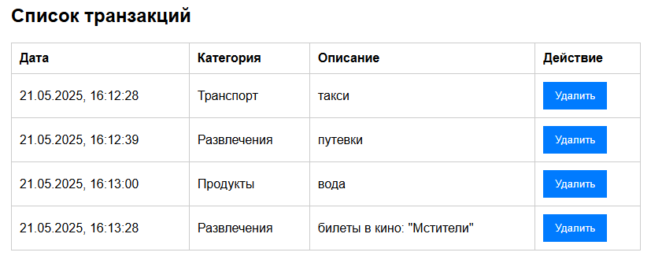
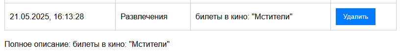

# Лабораторная №4 `Burteva Daria IA2403`

## Оглавление

* [Запуск проекта](#запуск-проекта)
* [Описание лабораторной работы](#описание-лабораторной-работы)
* [Список функций](#список-функций)
* [Вызов и использование](#вызов-и-использование)
* [Ответы на контрольные вопросы](#ответы-на-контрольные-вопросы)
* [Список использованных источников](#список-использованных-источников)


## Запуск проекта

* Откройте проект в редакторе VS Code с установленным расширением **Live Server**.
* Запустите сервер, нажав на кнопку **Go Live** в правом нижнем углу или через контекстное меню HTML-файла — «Открыть с помощью Live Server».

---

## Описание лабораторной работы

Цель лабораторной — ознакомить студентов с основами взаимодействия JavaScript с DOM-деревом на примере веб-приложения для учёта личных финансов.

---

## Список функций

В проекте реализовано 4 основных модуля:

### index.js

Связывает основную форму с обработчиком события:

```js
import {GetDataForm} from './ui.js';
import {form} from './ui.js';
form.addEventListener('submit', GetDataForm);
```

---

### ui.js

Отвечает за обработку событий и взаимодействие с DOM:

* **Получение и частичная валидация данных из формы**

```js
export function GetDataForm(event){
    event.preventDefault(); // предотвращает перезагрузку страницы
    const formData = new FormData(form);
    if(0 > Number(formData.get("sum")) || Number(formData.get("sum")) > 10000000 ){
        const errMsg = document.createElement("div");
        errMsg.innerHTML = "<p style =\"background-color: brown; color: white;\">incorrect amount: must be positive and less than 10,000,000</p>";
        form.appendChild(errMsg);
        setTimeout(()=>errMsg.remove(), 5000);
    }
    else{
        addTransaction(formData);
    }
}
```

* **Добавление транзакции в список и обновление отображения**

```js
export function addTransaction(data) {
    const now = new Date();
    const formattedDate = now.toLocaleString('ru-RU');
    const newId = generateId(formattedDate); 
    const transaction = {
        id: newId,
        date: formattedDate,
        amount: Number(data.get("sum")),
        type: data.get("type"),
        info: data.get("info")
    };

    transactions.push(transaction);

    renderTransaction(transaction);
    document.getElementById("add").reset();
    updateTotalSum();
}
```

* **Отображение транзакции в таблице**

```js
function renderTransaction(tx) {
    const newRow = document.createElement("tr");
    newRow.dataset.id = tx.id;
    newRow.addEventListener('click', handleRowClick);

    const cell1 = document.createElement("td");
    const cell2 = document.createElement("td");
    const cell3 = document.createElement("td");
    const cell4 = document.createElement("td");
    const sum = document.createElement("td");

    cell1.textContent = tx.date;
    cell2.textContent = tx.type;
    cell3.textContent = tx.info;
    sum.textContent = tx.amount;

    const btnDlt = document.createElement('button');
    btnDlt.textContent = "Удалить";
    btnDlt.onclick = () => {
        table.removeChild(newRow);
        const index = transactions.indexOf(tx);
        if (index > -1) transactions.splice(index, 1);
        const bl = document.getElementById("row2_1");
        bl.innerHTML = '';
        updateTotalSum();
    };
    cell4.appendChild(btnDlt);

    newRow.appendChild(cell1);
    newRow.appendChild(cell2);
    newRow.appendChild(sum);
    newRow.appendChild(cell3);
    newRow.appendChild(cell4);

    if(tx.type === "debit")
        newRow.id="debit-g";
    else if(tx.type === "credit")
        newRow.id="credit-r";
    table.appendChild(newRow);
}
```

* **Обработка клика по строке таблицы**

```js
function handleRowClick(event) {
    if (event.target.tagName.toLowerCase() === 'button') return;

    const row = event.currentTarget;
    const id = row.dataset.id;

    const transaction = transactions.find(t => t.id === id);
    changeInfo(transaction);
}
```

* **Вывод подробной информации о выбранной транзакции**

```js
function changeInfo(transaction){
    const bl = document.getElementById("row2_1");
    bl.innerHTML = '';
    const parag = document.createElement("p");
    parag.innerHTML = `
    Информация о транзакции:<br>
        id: ${transaction.id} <br>
        date: ${transaction.date} <br>
        amount: ${transaction.amount} <br>
        type: ${transaction.type} <br>
        info: ${transaction.info}
    `;
    bl.appendChild(parag);
}
```

* **Обновление общей суммы с учётом доходов и расходов**

```js
function updateTotalSum(){
    const sum = document.getElementById("total_sum").lastElementChild;

    let total_amount = 0;

    for (const tx of transactions) {
        const amount = Number(tx.amount);
        if (tx.type === "debit") {
            total_amount += amount;
        } else if (tx.type === "credit") {
            total_amount -= amount;
        }
    }

    sum.innerText = total_amount.toLocaleString("ru-RU", { minimumFractionDigits: 2 });
}
```

* **Обработчики кнопок для дополнительных функций**

```js
function buttonMostTransactionTypes(){
    if(transactions.length == 0){
        alert("transactions is empty");
        return;
    }
    const trns = mostTransactionTypes(transactions);
    alert(trns);
}
document.getElementById("most_trns_type").addEventListener('click', buttonMostTransactionTypes);

function buttonTotalDebitAmount(){
    if(transactions.length == 0){
        alert("transactions is empty");
        return;
    }
    const trns = calculateTotalDebitAmount(transactions);
    alert("Total debit amount:"+trns);
}
document.getElementById("total_debi_amount").addEventListener('click', buttonTotalDebitAmount);
```

---

### utils.js

* **Генерация уникального id транзакции**

```js
export function generateId(time) {
    time = time.replace(/[.,: ]/g, '');
    const rand = Math.floor(Math.random() * 1e5);
    return `${time}${rand}`;
}
```

---

## Вызов и использование

Сначала нужно ввести корректные данные в форму:


После успешного ввода новая запись появится в таблице:



При клике на строку таблицы в нижнем блоке отображается подробная информация о транзакции:



Снизу отображаеттся общая сумма всех транзакций:


---

## Ответы на контрольные вопросы

1. **Как получить доступ к элементу на веб-странице?**

Используются методы DOM:

```js
document.getElementById('id');
document.querySelector('.class');
document.querySelectorAll('div');
```

2. **Что такое делегирование событий?**

Техника, когда один обработчик ставится на родительский элемент, а события обрабатываются для потомков через `event.target`. Это удобно при динамическом создании элементов.

Пример:

```js
document.getElementById('list').addEventListener('click', function(event) {
  if (event.target.tagName === 'LI') {
    console.log('Clicked item:', event.target.textContent);
  }
});
```

3. **Как изменить содержимое элемента DOM?**

```js
element.textContent = 'Новый текст';
element.innerHTML = '<b>Жирный текст</b>';
```

4. **Как добавить новый элемент в DOM?**

```js
const newDiv = document.createElement('div');
newDiv.textContent = 'Привет!';
document.body.appendChild(newDiv);
```

---

## Список использованных источников

* [GitHub — Условия оформления](https://github.com/MSU-Courses/javascript/blob/main/lab/lab_guidelines.md)
* [Moodle — Условия лабораторной работы](https://moodle.usm.md/mod/assign/view.php?id=300747)
* [Stack Overflow](https://stackoverflow.com/)
* [JavaScript.info](https://learn.javascript.ru/)

---


