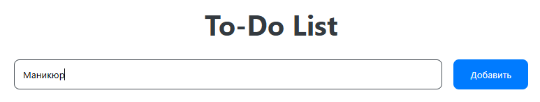
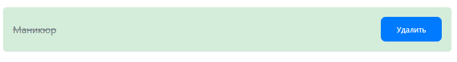
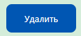
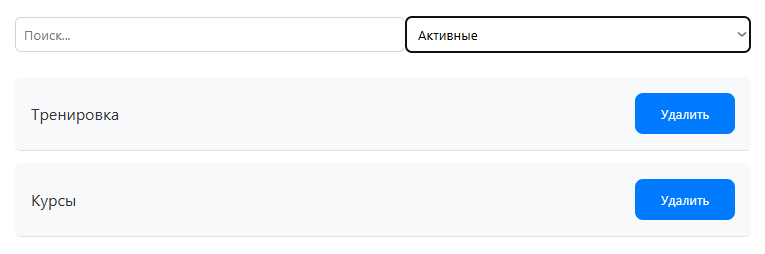
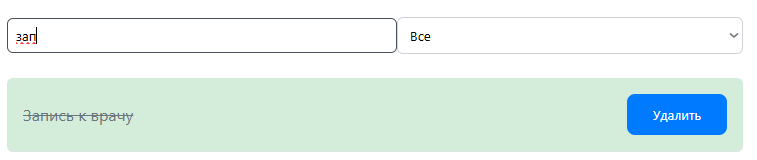

# Индивидуальный проект `Burteva Daria IA2403`

## Оглавление

* [Запуск проекта](#запуск-проекта)
* [Описание проекта](#описание-проекта)
* [Функциональные модули](#функциональные-модули)
* [Вызов и использование](#вызов-и-использование)
* [Технические детали](#технические-детали)
* [Ответы на контрольные вопросы](#ответы-на-контрольные-вопросы)
* [Источники](#источники)

## Запуск проекта

* Откройте проект в редакторе Visual Studio Code.
* Убедитесь, что установлено расширение **Live Server**.
* Откройте файл `index.html` с помощью Live Server (кнопка **Go Live** внизу или правый клик → «Open with Live Server»).
# Индивидуальный проект по дисциплине **«JavaScript»**

---

## Описание проекта

Цель проекта — реализовать веб-приложение "To-Do List" на **Vanilla JavaScript** с возможностью:

* Добавления новых задач.
* Отметки задач как выполненных.
* Удаления задач.
* Фильтрации задач по статусу (все/выполненные/невыполненные).
* Поиска задач по тексту.

В проекте не используются сторонние библиотеки и фреймворки — только **чистый JavaScript**, **HTML** и **CSS**.

---

## Функциональные модули

### `index.html`

Содержит HTML-разметку пользовательского интерфейса: форму для ввода задач, список задач, фильтры и поле поиска.

---

### `style.css`

Содержит стилизацию всего проекта. Использован современный внешний вид: закругленные формы, тени, адаптивность. Все размеры представлены в **пикселях**, согласно требованию.

---

### `script.js`

В этом модуле реализована вся логика:

* Обработка отправки формы и добавления задачи.
* Генерация уникального ID для каждой задачи.
* Обновление интерфейса при изменении состояния задач.
* Фильтрация по статусу.
* Поиск по ключевому слову.
* Обработка событий `click`, `input`, `change`.

#### Пример добавления задачи:

```js
form.addEventListener('submit', (e) => {
  e.preventDefault();
  const text = input.value.trim();
  if (text) {
    addTask(text);
    input.value = '';
  }
});
```

#### Пример фильтрации:

```js
filterSelect.addEventListener('change', () => {
  renderTasks();
});
```

#### Пример поиска:

```js
searchInput.addEventListener('input', () => {
  renderTasks();
});
```

---

## Вызов и использование

**Добавление задачи:**
Введите текст задачи в поле и нажмите "Добавить".


**Отметить как выполненную:**
Нажмите на задачу — она зачеркнется и пометится зеленым фоном.


**Удаление задачи:**
Нажмите кнопку "Удалить" рядом с нужной задачей.


**Фильтрация задач:**
Выберите из выпадающего списка нужный статус (все/выполненные/невыполненные).


**Поиск:**
Введите часть текста — останутся только соответствующие задачи.


---

## Технические детали

* Используются современные возможности **ES6+**: `const`, `let`, стрелочные функции, `forEach`, шаблонные строки и другие.
* Код организован в виде функций и модульных блоков.
* Состояние задач хранится в массиве объектов:

```js
{
  id: 'task_12345',
  text: 'Купить хлеб',
  completed: false
}
```

* Все действия пользователя автоматически отображаются в DOM.

---

## Ответы на контрольные вопросы

1. **Как получить доступ к элементу на веб-странице?**

```js
document.getElementById('id')
document.querySelector('.class')
document.querySelectorAll('div')
```

2. **Что такое делегирование событий?**

Делегирование — это установка обработчика на родительский элемент и проверка `event.target`:

```js
ul.addEventListener('click', (event) => {
  if (event.target.tagName === 'LI') {
    toggleComplete(event.target);
  }
});
```

3. **Как изменить содержимое DOM-элемента?**

```js
element.textContent = 'Новый текст';
element.innerHTML = '<b>HTML</b>';
```

4. **Как добавить новый элемент в DOM?**

```js
const el = document.createElement('li');
el.textContent = 'Новая задача';
ul.appendChild(el);
```

5. **Как валидировать ввод пользователя?**

Проверка на пустую строку:

```js
if (input.value.trim() === '') {
  alert('Введите текст задачи');
}
```

---

## Источники

* [JavaScript.info](https://learn.javascript.ru/)
* [MDN Web Docs](https://developer.mozilla.org/ru/)
* [Stack Overflow](https://stackoverflow.com/)
* Условия индивидуального проекта (Moodle + GitHub)
