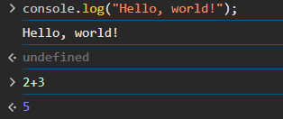
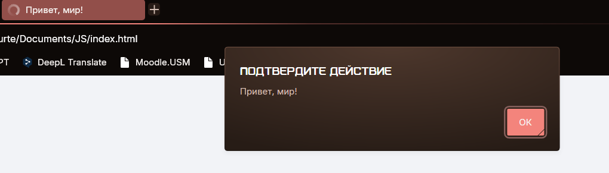
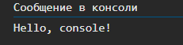
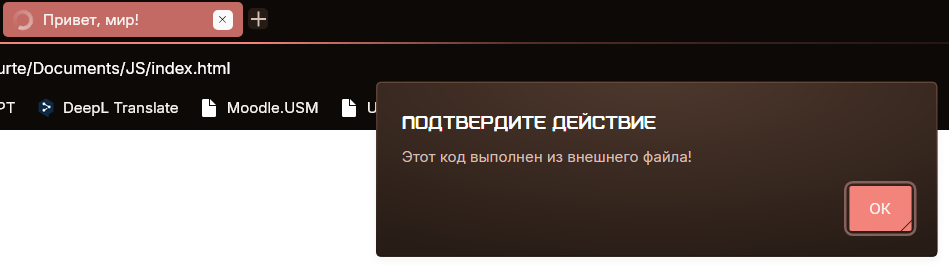
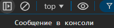
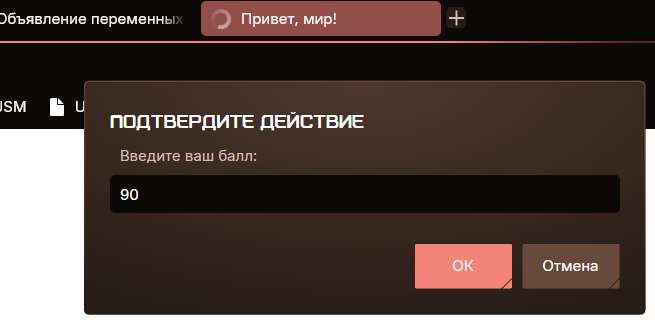
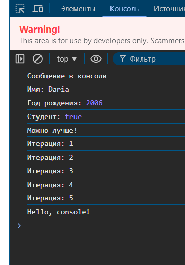

# Лабораторная №1
## Задание 1

1. Подготовка среды:
- Устанавливаем текстовый редактор VS Code.
- Устанавливаем Node.j

2. Выполнение кода JavaScript в браузере

   - Открываем консоль разработчика (`F12` → `Console`).
   - Пишем команду `console.log("Hello, world!");` и нажал Enter.
   - Записываем в консоли `2 + 3` и смотрим результат.

    

3. Выполнение кода JavaScript в браузере
    - Создаем файл `index.html` и вставляем в него следующий код.

   ```html
   <!DOCTYPE html>
   <html lang="en">
     <head>
       <title>Привет, мир!</title>
     </head>
     <body>
       <script>
         alert("Привет, мир!");
         console.log("Hello, console!");
       </script>
     </body>
   </html>
   ```

   - Открываем `index.html` в браузере и смотрим, как выполняется код.

  
  

4. Подключение внешнего JavaScript-файла
    - Создаем файл script.js и добавляем в него     код:

       ```javascript
       alert("Этот код выполнен из внешнего файла!");
       console.log("Сообщение в консоли");
       ```

    - Подключаем файл в `index.html`,    добавляем в `<head>`

       ```html
       <script src="script.js"></script>
       ```

    - Открываем страницу в браузере.
       
       

       ## Задание 2
       1. Объявление переменных и работа с типами данных.
       
          - В файле `script.js` создаем несколько переменных:
       
            - `name` - строка с вашим именем.
            - `birthYear` - число, представляющее год вашего рождения.
            - `isStudent` - логическая переменная, указывающая, являетесь ли вы студентом.
       
          - Выводим их в консоль.
       
       2. Управление потоком выполнения (условия и циклы)
       
          - Добавляем следующий код в `script.js`:
       
          ```javascript
          let score = prompt("Введите ваш балл:");
          if (score >= 90) {
            console.log("Отлично!");
          } else if (score >= 70) {
            console.log("Хорошо");
          } else {
            console.log("Можно лучше!");
          }
       
          for (let i = 1; i <= 5; i++) {
            console.log(`Итерация: ${i}`);
          }
          ```
       
          - Открываем страницу в браузере и смотрим, как работают условия и циклы.
       
           
           


          
 ## Контрольные вопросы
1. Переменные
   - `var` - старый вид переменной, это изменяемая и переопределяемая переменная.
   - `let` - это изменяемая и непереопределяемая переменная.
   - `const` - это неизменяемая и непереопределяемая переменная.

 2. `Неявное преобразование`  - это автоматическое преобразование типа значения или переменной, например при использовании арифметических операций `*, +, -` между разными по типу значениями `let result = "10" - 5;`

 3. `==` - это проверка совпадения значений, без проверки типа переменной, в то время как `===` проверяет сначала совпадение по значению, а потом еще и по типу данных
    ```javascript
     console.log(5 == "5");   // true — неявное преобразование строки в число
     console.log(5 === "5");  // false — строгое сравнение без преобразования
    ```
